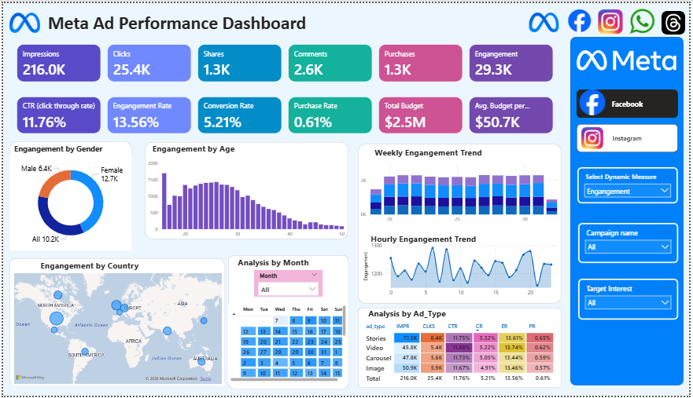
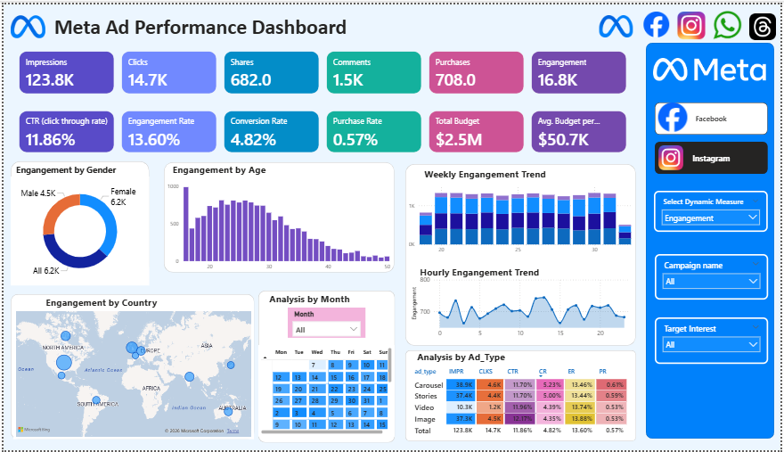

# 📊 Meta Ad Performance Analysis – Power BI Project

An end-to-end Business Intelligence project analyzing Meta (Facebook & Instagram) advertising performance using Power BI.

---

## 📌 Table of Contents

- [Project Overview](#project-overview)
- [Business Problem](#business-problem)
- [Dashboard Preview](#dashboard-preview)
- [Data Model](#data-model)
- [Key KPIs](#key-kpis)
- [Dashboard Features](#dashboard-features)
- [Key Insights](#key-insights)
- [Business Recommendations](#business-recommendations)
- [Project Documents](#project-documents)
- [Repository Structure](#repository-structure)
- [Tools Used](#tools-used)
- [Author](#author)

---

## 📖 Project Overview

This project analyzes advertising performance data from Meta platforms to evaluate campaign effectiveness, engagement performance, and conversion efficiency.

The objective is to generate actionable insights that help optimize marketing spend and improve ROI.

---

## 🎯 Business Problem

Marketing teams require visibility into:

- Campaign reach and impressions
- Engagement behavior
- Conversion performance
- Budget allocation efficiency
- Platform-level performance comparison

The goal is to identify optimization opportunities across the advertising funnel.

---

## 📊 Dashboard Preview

### 🔹 Facebook Dashboard



### 🔹 Instagram Dashboard



---

## 🧩 Data Model

The dataset follows a **Star Schema** structure:

- **Fact Table**
  - ad_events (Impressions, Clicks, Shares, Purchases)

- **Dimension Tables**
  - ads
  - campaigns
  - users

The model enables performance tracking across demographic, campaign, and platform dimensions.

---

## 📈 Key KPIs

- Total Impressions
- Total Clicks
- Total Engagements
- Total Purchases
- Click Through Rate (CTR)
- Engagement Rate
- Conversion Rate
- Purchase Rate
- Total Budget
- Average Budget per Campaign

---

## 📊 Dashboard Features

- KPI Performance Cards
- Gender-wise Engagement Analysis
- Age Group Segmentation
- Country-wise Performance Map
- Weekly & Hourly Trend Analysis
- Calendar Heatmap
- Ad Type Performance Matrix
- Facebook vs Instagram Comparison

---

## 🔍 Key Insights

- Strong top-of-funnel performance with high CTR and engagement rate.
- Conversion rate indicates drop-off at purchase stage.
- Female audience aged 18–30 shows highest engagement.
- Peak activity observed during afternoon and evening hours.
- Video and Story ad formats outperform other creatives.

---

## 💡 Business Recommendations

- Improve landing page optimization to increase conversions.
- Allocate higher budget to high-performing ad formats.
- Focus targeting on engaged demographic segments.
- Schedule ads during peak engagement hours.
- Optimize spending across top-performing regions.

---

## 📄 Project Documents

- 📘 Business Requirements Document (BRD)
- 📗 Domain Knowledge Document
- 📙 Dashboard Insights Report
- 📊 Power BI (.pbix) File
- 📁 Dataset (CSV Files)
- 

All documents are included in this repository for complete project transparency.

---

## 📂 Repository Structure

```
META_AD_ANALYSIS_PROJECT/
│
├── Dataset/
│ ├── ad_events.csv
│ ├── ads.csv
│ ├── campaigns.csv
│ └── users.csv
│
├── Images/
│ ├── Facebook_Logo_2023.png
│ ├── Instagram_icon.png
│ ├── Threads_app.png
│ └── whatsapp.png
│
├── Screenshot/
│ ├── Meta_Dashboard_facebook.png
│ └── Meta_Dashboard_instagram.png
│
├── Dashboard.pbix
├── Dashboard_Insights_Report.pdf
├── Domain_Knowledge_Document.pdf
├── Meta_Ad_Performance_Analysis_BRD_Doc.pdf
│
└── README.md

```

---

## 🛠 Tools Used

- Power BI
- DAX
- Data Modeling (Star Schema)
- Excel / CSV

---

## 👤 Author

Onkar Ithape  
Aspiring Data Analyst  
Email - onkarithape.work@gmail.com
GitHub: https://github.com/onkarithape1512
